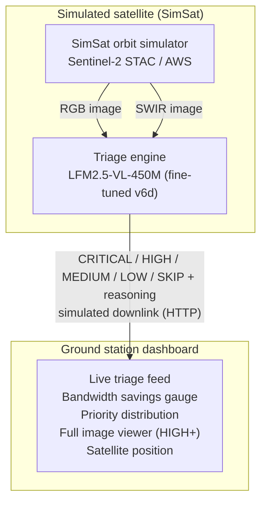
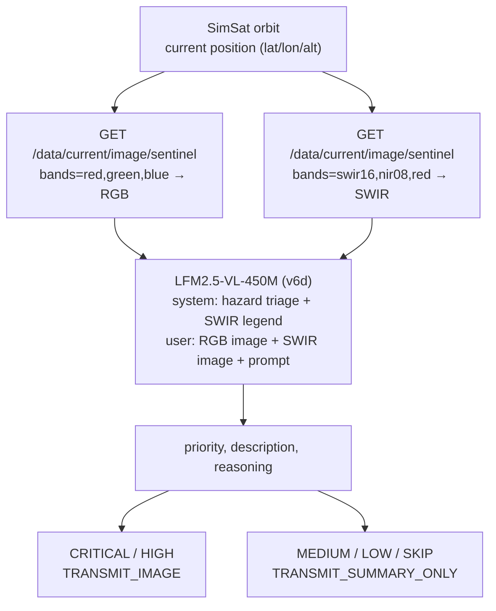

# Architecture

## System Overview



## The Problem automatic-downlink Solves

A low-Earth-orbit satellite captures an image roughly every 30 seconds. With a
5 Mbps downlink budget, transmitting every frame at full resolution is
impossible. Current systems either send everything (expensive) or rely on
rigid threshold rules (miss critical events).

**automatic-downlink** runs an on-board VLM to read each image and decide:
> "Does this image show something that the ground needs to see right now?"

Only CRITICAL/HIGH images are downlinked at full resolution. Everything else
sends a 1-sentence text summary (~0.5 KB vs ~500 KB per image). Typical
bandwidth savings: **97–99%**.

## Hazard Scope

The model is trained and prompted to detect three mission-critical hazards:

| Hazard | SWIR signature | Why it matters |
|--------|---------------|----------------|
| **Wildfire** | Active fire = bright red pixels | Hours matter for evacuation |
| **Flood** | Dark blue (water absorption) | Infrastructure damage, relief routing |
| **Landslide** | Exposed soil, debris fans | Blocks roads, burial risk |

## Model: LFM2.5-VL-450M (Fine-tuned)

### Base model

LFM2.5-VL-450M - Liquid AI's 450M-parameter vision-language model, chosen
because the hackathon track requires an LFM2.5-VL model and its small size
makes it viable for on-board satellite inference.

### Fine-tuning journey

| Version | Strategy | CRITICAL recall |
|---------|-----------|-----------------|
| v6 base | Full fine-tune, raw dataset | 0% (MEDIUM collapse) |
| v6b | Same, 3× CRITICAL upsample | 0% (bias too strong) |
| v6c | 3× CRITICAL + MEDIUM cut | 0% (still collapsed) |
| **v6d** | 5× CRITICAL + MEDIUM cut to 6 | **75% (3/4)** |

Training infrastructure: Modal H100 serverless GPU, `leap-finetune` framework,
full fine-tune (no LoRA - vision tower included), 5 epochs, LR 2e-5.

Weights published to HuggingFace:
`marcelo-earth/LFM2.5-VL-450M-satellite-triage-v6`. Despite the repo name, it
holds the v6d weights; the app pins commit `c42df7c5` so every build loads v6d.

### Dual-image inference

Each inference pass receives **two images**:

1. **RGB** - natural color Sentinel-2 composite (`[red, green, blue]`)
2. **SWIR false-color** - `[swir16, nir08, red]` - makes fire and water
   spectrally distinct even under smoke or haze

The model is fine-tuned on RGB+SWIR pairs, so it can reason across both
channels simultaneously in a single forward pass.

### Output schema

```json
{
  "image_id": "IMG_4821",
  "timestamp": "2026-04-15T12:34:56Z",
  "position": {"lat": -12.05, "lon": -77.04, "alt": 791.3},
  "description": "Urban area with visible flooding in eastern quadrant. Multiple roads submerged.",
  "priority": "CRITICAL",
  "reasoning": "Active flooding affecting populated area. Time-sensitive for disaster response.",
  "downlink_recommendation": "TRANSMIT_IMAGE"
}
```

## Priority Levels

| Level | Meaning | Downlink Action |
|-------|---------|----------------|
| **CRITICAL** | Active hazard, immediate threat to life | Full image + metadata |
| **HIGH** | Significant event, time-sensitive | Full image + metadata |
| **MEDIUM** | Notable change, worth monitoring | Thumbnail + metadata |
| **LOW** | Minimal interest | Text summary only |
| **SKIP** | Clouds, open ocean, no content | Text summary only |

## Docker Services

```
docker compose up
```

Starts three services:

| Service | Port | Purpose |
|---------|------|---------|
| `simsat-dashboard` | 8000 | SimSat orbit simulator + image server |
| `simsat-api` | 9005 | SimSat REST API (Sentinel-2 + Mapbox imagery) |
| `triage-dashboard` | 8080 | Triage engine + ground station UI |

### Triage loop

Every 30 seconds by default (configurable via `POLL_INTERVAL`):
1. Fetch current satellite position from SimSat
2. Fetch RGB image and SWIR false-color composite for that position
3. Pre-filter cheap pixel signals (cloud, dark, featureless tiles) and skip the VLM when the frame is unusable
4. Run dual-image inference on LFM2.5-VL-450M
5. Store the decision; the dashboard polls the REST API (`/api/decisions`, `/api/stats`)

## Data Flow



## Deployment Target (OmniSat)

| Constraint | Value | How We Handle It |
|-----------|-------|-----------------|
| GPU | NVIDIA Orin 16 GB | 450M model ≈ 900 MB fp32, fits with headroom |
| Inference latency | ~2s / image pair (GPU) | Well within 30s orbit cadence |
| Downlink budget | 5 MB / pass | Text summaries ≈ 0.5 KB; full image ≈ 500 KB |
| Storage | 1 GB | Model weights pre-loaded in Docker image |
| Runtime | Docker | Already containerized, one-command start |

## Repository Layout

```
automatic-downlink/
  src/
    triage/
      engine.py       - triage pipeline (cloud pre-filter, dual-image routing)
      model.py        - LFM2.5-VL-450M wrapper (generate / generate_dual)
      prompts.py      - system + user prompts for triage (default / disaster / dual)
      schemas.py      - TriageResult dataclass + priority enum
      loop.py         - polling loop (POLL_INTERVAL, default 30s), SimSat fetch, SWIR companion fetch
      scenarios.py    - finite replay scenarios for the demo
    simsat/
      client.py       - SimSat REST API client
    dashboard/
      app.py          - FastAPI app: /api/decisions, /api/stats, scenarios, static UI
  training/
    data/
      exp6_train.jsonl        - base training set (RGB+SWIR pairs)
      exp6d_train.jsonl       - rebalanced set (5× CRITICAL, MEDIUM cut)
    configs/
      triage_vlm_sft_v6d_modal.yaml  - leap-finetune config
    scripts/
      build_exp6d_train.py    - class rebalancing script
      push_v6d_to_hub.py      - push inference files to HuggingFace
  scripts/
    evaluate_exp6_on_modal.py - Modal eval harness
    labeling_prompt.md        - GPT-4V labeling instructions
  experiments/EXP_6.md - experiment log (all v6 runs, evals, decisions)
  CHANGELOG.md        - daily session log
  Dockerfile
  docker-compose.yml
```
